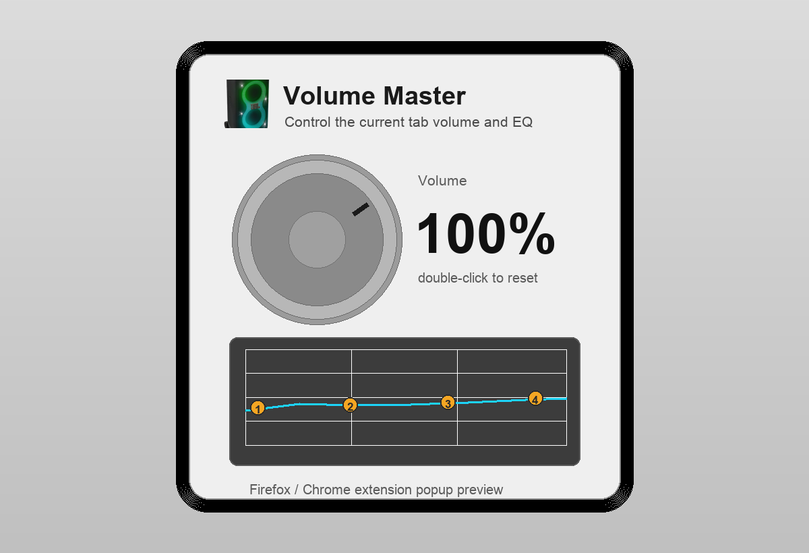

# Volume Master

A browser extension that lets you control the current tab’s volume and EQ.

## Download
[Download ZIP](https://github.com/Bolbol-AudioCourt/Browser-Tab-Volume-Master/archive/refs/heads/main.zip)

## Firefox
1. Download and unzip the project.
2. Open Firefox.
3. Go to `about:debugging#/runtime/this-firefox`
4. Click **Load Temporary Add-on...**
5. Open the `firefox` folder.
6. Select `manifest.json`

## Chrome
1. Download and unzip the project.
2. Open Chrome.
3. Go to `chrome://extensions`
4. Turn on **Developer mode**
5. Click **Load unpacked**
6. Select the `chrome` folder.
